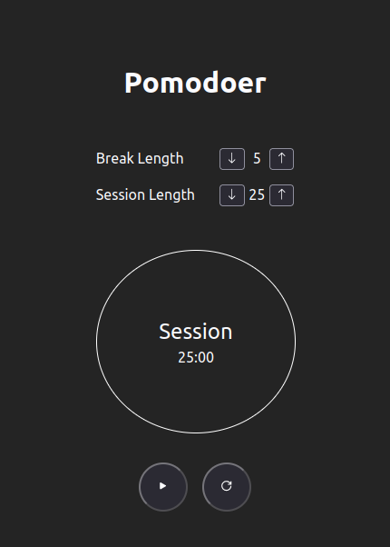
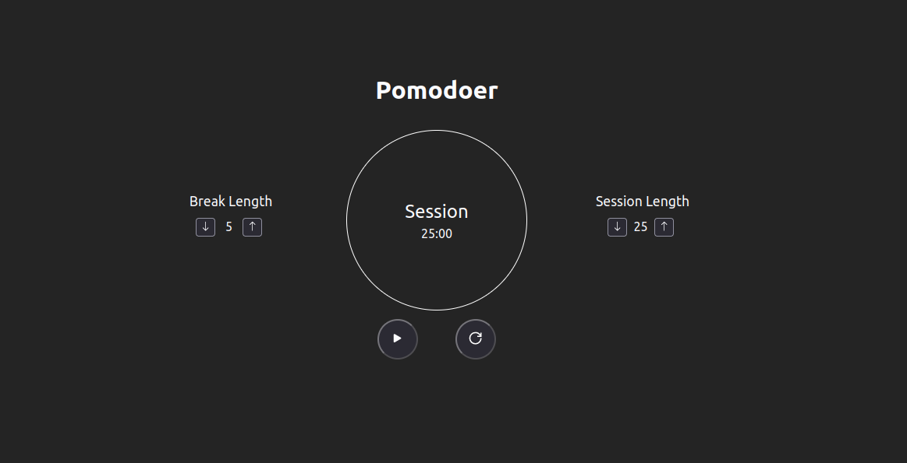

# Pomodoer

Welcome to the Pomodoer!

This web application is designed to help you improve your productivity by using the Pomodoro Technique, a time management method developed by Francesco Cirillo in the late 1980s.

## How to Use
<ol>
    <li>Click the "Play" button to start the timer</li>
    <li>Work on your task until the timer rings, indicating the end of the work session</li>
    <li>Take a short break (usually 5 minutes)</li>
    <li>Repeat steps 2-4 for a total of four work sessions</li>
    <li>After completing four work sessions, take a longer break (usually 15-30 minutes)</li>
    <li>Repeat the process as necessary</li>
</ol>

## Feature Overview
- Adjustable Timer: You can set the timer to the length of time you prefer for work sessions and breaks.
- Pause and Resume: You can pause the timer at any time and resume it later.
- Notification: You will be notified when the timer is up
- Reset: You can reset the timer default setting

## Tech Stack
This web application was built using the following technologies:

- HTML
- CSS
- React
- TypeScript

## Screenshots

## Run Locally

After you clone this repo to your desktop, go to its root directory and run `npm install` to install its dependencies.

Once the dependencies are installed, you can run  `npm run dev` to start the application. You will then be able to access it at localhost